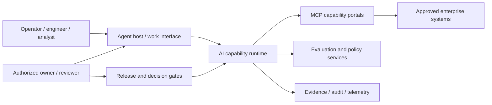

# AI-native reference architecture

This architecture keeps the model replaceable, tools bounded, context attributable, and decisions human-governed.

It implements the [AI-native manufacturing program north star](ai-native-program-north-star.md). Architecture choices should be rejected when they transfer reusable platform complexity to application creators or make bypassing the governed path materially easier.

## System context



## Containers and ownership

| Container | Owns | Must not own |
|---|---|---|
| Work interface / host | user intent, consent, session, portal connection, approval display | hidden business authority |
| Agent runtime | orchestration, context assembly, model/tool loop, bounded task state | source-system truth or production credentials by default |
| Skill registry | versioned reusable procedures, triggers, dependencies, evaluations | case evidence or local approval |
| Context/retrieval service | source selection, provenance, freshness, compaction | rewriting source authority |
| MCP portal | domain capabilities, schemas, authorization enforcement, audit | unrestricted system access or cross-server token transit |
| Evaluation/policy service | deterministic controls, scenario suites, release thresholds | business acceptance outside delegated policy |
| Evidence/telemetry store | tool events, approvals, versions, results, incidents | silently becoming the product/configuration master |
| Delivery factory | build/review/test/release/rollback mechanics | self-approval of high-risk changes |

## Behavioral flow

```text
User intent and authority
→ task classification and risk tier
→ applicable instructions/skills
→ just-in-time evidence retrieval
→ plan and bounded tool call
→ schema/policy validation
→ human gate when required
→ action and attributable result
→ outcome monitoring
→ incident/evaluation fixture
→ governed skill/context/tool revision
```

## Deployment zones

1. **Development:** synthetic/sanitized fixtures, no production credentials, isolated side effects.
2. **Evaluation:** representative authorized cases, controlled connectors, recorded comparison and adversarial tests.
3. **Assisted production:** read/propose capabilities, explicit human action, full monitoring and rapid revoke.
4. **Bounded execution:** narrow pre-authorized mutations with target validation, idempotency, audit, rollback, and tripwires.

Promotion between zones is a recorded risk/release decision. Model capability alone never changes the zone.

## Versioned behavior configuration

Record model/provider, system instructions, profile, skills, context/retrieval policy, portal/tool versions, deterministic policies, dependencies, evaluation set, and deployment configuration for every release. Any change can alter behavior and therefore defines a new evaluated configuration.

## Fitness functions

1. Every external fact/recommendation exposed to a user cites its source and freshness.
2. Every tool call identifies actor/session, portal/tool version, target, scope, result, and approval when required.
3. No production credential is available to development or evaluation agents.
4. Read, propose, approve, and execute capabilities are separately authorized.
5. Untrusted content cannot alter instruction precedence or tool authority.
6. Every release passes deterministic, scenario, security, and domain evaluation thresholds.
7. A high-risk change cannot be implemented and accepted by the same agent context alone.
8. Runtime incidents create a sanitized regression fixture before closure where feasible.
9. Every production capability has owner, monitor, kill/revoke, rollback, support, and retirement paths.
10. Operational value is measured against a baseline; agent activity is not value.
