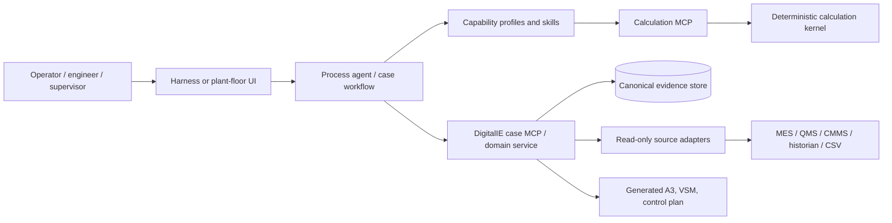

# Reference architecture

## Design thesis

The durable object is an **improvement case**, not a chat transcript and not a generated A3. A case is a chain of traceable evidence and decisions. Human-readable reports are projections of that chain.

The corpus has two orthogonal views: capability playbooks explain methods; process maps organize work from trigger to handoff. Process agents use capability profiles as specialist critics and stop at human decision gates.

AI-native delivery uses the same model. [Its reference architecture](ai-native-architecture.md) separates host, agent runtime, skills, context, MCP portals, evaluation/policy, evidence, and delivery-factory responsibilities.

## Bounded contexts

| Context | Owns | Must not do |
|---|---|---|
| Case management | case state, participants, approvals, audit | compute statistics |
| Evidence | immutable source references and observations | assert causes |
| Analysis | reproducible calculations and outputs | alter source facts |
| Improvement method | DMAIC, A3, 5 Why, Gemba workflow gates | write to plant systems |
| Integration | source normalization and credentials | embed plant vendor semantics in core |
| Rendering | Markdown/PDF/diagrams | become canonical record |

## Runtime topology

The planned case-management MVP is one application service with PostgreSQL. Its MCP will be a narrow facade over the domain service, usable from any compatible harness. Source adapters will operate read-only and may later be independently deployed for network segmentation. These components are architectural intent, not current runtime claims.

The calculation kernel is separately usable as a Python library and through a local read-only MCP stdio adapter. It requires no database. Domain packs follow the [calculation pack standard](calculation-pack-standard.md), while calculation receipts can later be attached to improvement cases by the case service; arithmetic availability does not depend on that future persistence layer.

## Fitness functions

1. Every `verified` root cause links to one or more evidence IDs and an approval.
2. Every analysis links to immutable input evidence and declares its method/version.
3. No plant write can execute without a named approver and audit event.
4. Rendering never owns source-of-truth data.
5. Core entities cannot contain vendor-specific field names.
6. Every material agent-generated calculation uses a named, versioned method and preserves a calculation receipt.
